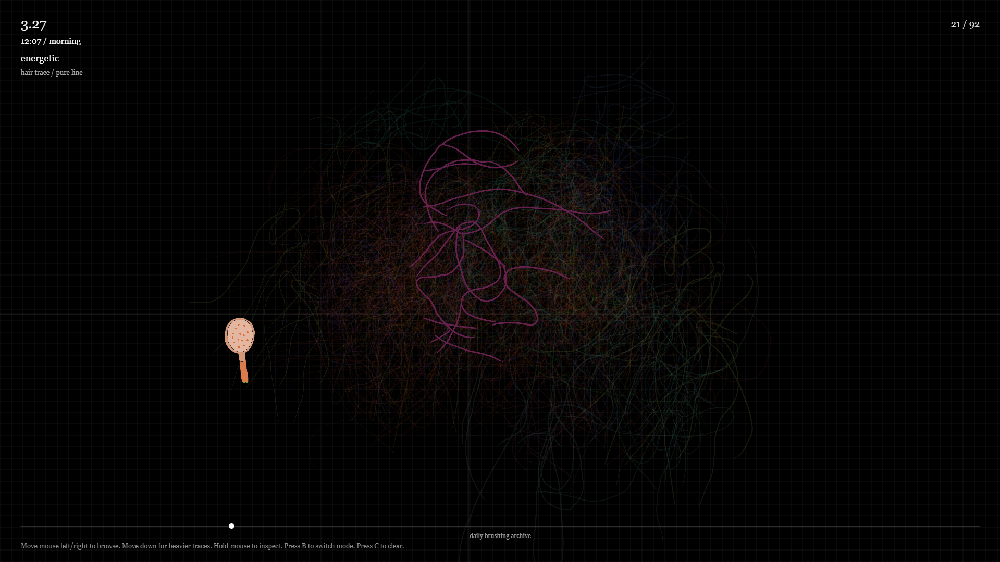
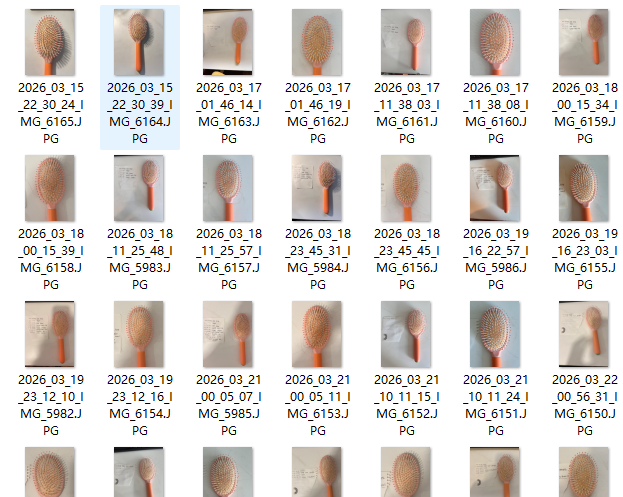
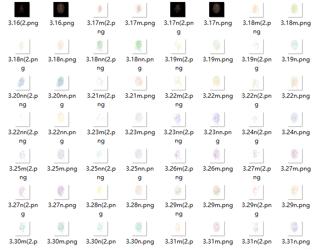

# OhNoMyHair-JsonProject
From a female who has long hair.

## Project Description

OH NO MY HAIR is a real time interactive archive made with p5.js.

The project turns 92 moments of brushing hair into a visual system. I recorded the hair left on my brush every morning and night. Each record includes a date, time, feeling, and two hand drawn images.

The project explores hair anxiety, daily self checking, and the body as personal data.

## Concept

This project is not mainly about how much hair I lost. It is about the ritual of checking.

Every morning and night, I brushed my hair, photographed the brush, wrote down the time and feeling, and traced the hair by hand. This repeated action became like a daily check in.

The pure hair images show real body traces. The dotted brush images show a more mechanical recording system.

## Interaction

Move the mouse left and right to browse the archive.

Move the mouse down to make the traces heavier.

Hold the mouse to inspect one record.

Press B to switch between pure hair images and dotted brush images.

Press C to clear the accumulated traces.

## Technical Information

This project was made with p5.js in VSCode.

The data is stored in a JSON file. The JSON file organises 92 records. Each record includes the date, time, emotion, and image paths.

The project loads 184 transparent images. It uses arrays to store the images. It also uses a graphics layer to create accumulated traces on the screen.

## Project Process

## Visual Materials

## Files

index.html

sketch.js

data/hairRecords.json

assets/raw/

assets/cursorBrush.png

## How to Run

Open the project folder in VSCode.

Use a local server to run the project.

You can use the Live Server extension in VSCode.

Open index.html in the browser through Live Server.

## References

Lupi, G. and Posavec, S. (2015) Dear Data. Available at: https://www.dear-data.com/theproject

Harrison, E. (2005) Daily Data Display Wall. Available at: https://www.ellieharrison.com/displaywall/

Levin, G. (2007) Eyecode. Available at: https://www.flong.com/archive/projects/eyecode/index.html

Lozano Hemmer, R. (2006) Pulse Room. Available at: https://www.lozano-hemmer.com/pulse_room.php

Reas, C. (2004) Process Compendium. Available at: https://gray.reas.com/compendium_b_p/
